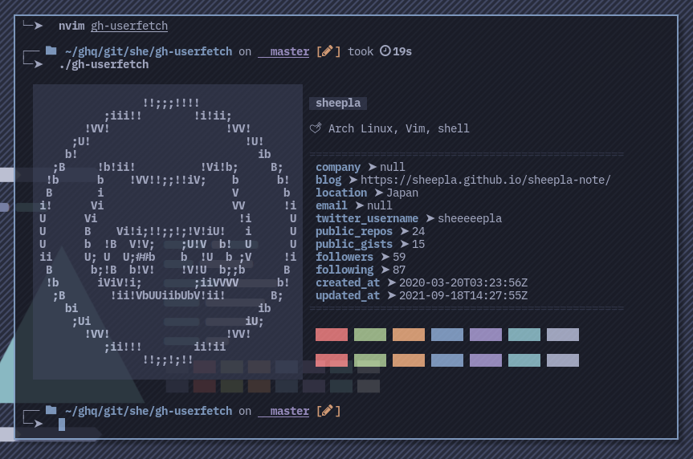

# 👨‍💻 gh-userfetch

An extension for [GitHub CLI](https://github.com/cli/cli) to show your GitHub profile inspired by [dylanaraps/neofetch](https://github.com/dylanaraps/neofetch) .



## Usage

Just run `gh userfetch` but needs authentication with GitHub host: `gh auth login`.

## Installation

Install [GitHub CLI](https://github.com/cli/cli), then run below.

```bash
gh extension install sheepla/gh-userfetch
```
